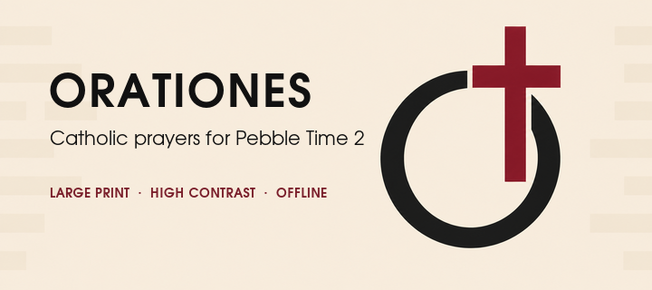

<p align="center">
  
</p>

# Orationes

[](https://github.com/ewijaya/pebble-orationes/releases/latest)

A large-print, high-contrast Catholic prayer app for Pebble Time 2.

**[Install from the Pebble App Store](https://apps.repebble.com/9882f741750c43eb8309777e)**

Orationes is a personal native Pebble C app built specifically for Pebble Time 2 (`emery`). It favors readability on a small display through large bold text, strong black-and-white contrast, touchscreen scrolling, and hardware-button navigation. It works fully offline and is created and maintained by Edward.

<p align="center">
  
  
  
</p>

## What's included

- **Preces** — complete Latin text in a large-print, scrollable view.
- **Holy Rosary** — Today's Mysteries, All Mysteries, and the Litany of Loreto. The watch chooses Joyful (Mon/Sat), Sorrowful (Tue/Fri), Glorious (Wed/Sun), or Luminous (Thu) mysteries from its local weekday.
- **Regina Caeli** — English text in a scrollable view.
- **Angelus** — English text in a scrollable view, with each Hail Mary abbreviated as `Hail Mary ...`.

Prayer screens use `FONT_KEY_GOTHIC_28_BOLD` with 8 px margins. Menus use 54 px rows with white-on-black selection and black-on-white unselected items.

## On a physical Pebble Time 2

<p align="center">
  
</p>

## Install

**[Install Orationes from the Pebble App Store](https://apps.repebble.com/9882f741750c43eb8309777e)**

1. Open the Orationes listing.
2. Add it to your apps.
3. Install or sync it to your Pebble Time 2.

This installation path has been tested on a physical Pebble Time 2. The current release, v0.2.1, targets `emery`.

For manual installation, download `pebble-orationes.pbw` from [GitHub Releases](https://github.com/ewijaya/pebble-orationes/releases) and install it through the Pebble/RePebble app workflow.

## Development

<details>
<summary>Build, architecture, and screenshot workflow</summary>

### Build

Requires Pebble Tool 5.0.40 or newer and Pebble SDK 4.33.1 or a compatible current SDK.

```sh
pebble clean
pebble build
```

The application bundle is written to `build/pebble-orationes.pbw`.

```sh
pebble install --emulator emery
pebble install --cloudpebble build/pebble-orationes.pbw
```

### Architecture

Orationes is an Emery-only native Pebble C SDK application. It has no PebbleKit JS, phone-side code, or network access. A reusable prayer screen renders scrollable texts, a reusable accessible menu renderer provides the high-contrast navigation, and Rosary data is kept separate from its menus. Prayer content is separated from UI code where practical. Builds produce a `.pbw` application bundle.

### Updating screenshots

Regenerating framed screenshots requires Python 3 and Pillow:

```sh
python3 -m pip install Pillow
python3 scripts/frame_screenshots.py
```

The script reads Emery captures from `build/emulator-screenshots/`, copies them to `docs/images/raw/`, and writes composites to `docs/images/framed/`. The `build/` directory remains ignored.

</details>

## Disclaimer

Orationes is an independent personal project. It is not an official application of, or endorsed by, Opus Dei, the Catholic Church, Core Devices, or Pebble.
