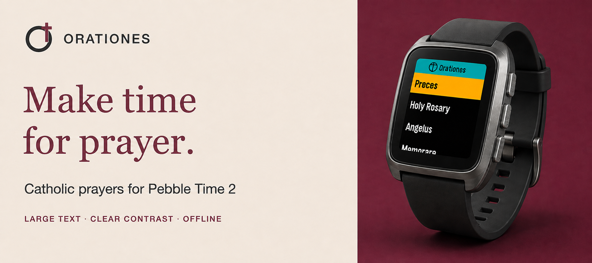

# Orationes

[Latest release](https://github.com/ewijaya/pebble-orationes/releases/latest)

Your Pebble tells time. Orationes helps you make time for prayer.

**[Install from the Pebble App Store](https://apps.repebble.com/9882f741750c43eb8309777e)**

Orationes is a personal native Pebble C app built specifically for Pebble Time 2 (`emery`). It favors readability on a small display through large bold text, strong contrast, touchscreen scrolling, and hardware-button navigation.

<p align="center">
  <a href="https://apps.repebble.com/9882f741750c43eb8309777e"></a>
</p>

## What's included

- **Preces** — complete Latin text in a large-print, scrollable view.
- **Holy Rosary** — Today's Mysteries, All Mysteries, and the Litany of Loreto. The watch chooses Joyful (Mon/Sat), Sorrowful (Tue/Fri), Glorious (Wed/Sun), or Luminous (Thu) mysteries from its local weekday.
- **Regina Caeli** — English text in a scrollable view.
- **Angelus** — English text in a scrollable view, with each Hail Mary abbreviated as `Hail Mary ...`.
- **Memorare** — English text in a scrollable view.
- **More Prayers** *(optional)* — prayers for Mental Prayer, Visit & Communion, Before Work, and Night Examination.
- **Confession** *(optional)* — an examination of conscience, Act of Contrition, and prayers before and after Confession.
- **Prayer library** — Psalm 50 (51), Psalm 2, Acceptance of Death, Prayer for Vocations, Blessed Be Your Purity, and the Canticle of the Three Children.
- **Aspirations** *(optional)* — 92 short prayers, with italic Latin paired with English where supplied, and concise Scripture references.
- **Prayer Cards** *(optional)* — a collection of 14 intercessory prayers, also available as individual shortcuts. Supplied private-use declarations are retained in small print.

The default menu stays focused on the five core entries. On the watch or in the Pebble app, **Prayer Shortcuts** can fill up to seven main-menu slots from the wider library while preserving those defaults until changed. Settings also offer Large or Extra Large text, light and dark appearances, adaptive accents, and an optional noon Angelus/Regina Caeli reminder. Holding Up or Down moves quickly through long prayers; double-clicking Select exits directly to the watchface, and long menus wrap in both directions.

**Continue** offers **Resume** or **Start again** for your last saved prayer. Ordinary prayer openings start at the top. **Remember Place** can be disabled in watch or phone Settings. **All Prayers** lets you browse five categories and open any prayer or pin it to the main menu. Settings recover from interrupted writes, and phone changes wait for confirmation from the watch before being marked saved.

**Fixed in v0.8.1:** Save Settings in the phone's Clay configuration page now sends changes to the watch correctly. Pending changes also resume after restarting Orationes. Verified with MyApp and a physical Pebble Time 2; see [release verification](docs/verification.md).

Version 0.8.0 introduced independent navigation highlights, appearance previews, a cleaner reading progress indicator, and refreshed menus. See the [UI changes](docs/ui-refresh.md).

Selecting a prayer for a shortcut on the watch saves it and returns to the main menu with that prayer highlighted.

Browse the [prayer directory](docs/prayer-list.md) for the complete library, languages, and shortcut names.

## Install

**[Install Orationes from the Pebble App Store](https://apps.repebble.com/9882f741750c43eb8309777e)**

1. Open the Orationes listing.
2. Add it to your apps.
3. Install or sync it to your Pebble Time 2.

Orationes **v0.8.1** targets Pebble Time 2 (`emery`). Use the App Store installation flow above or download the PBW from GitHub Releases.

For manual installation, download `pebble-orationes.pbw` from [GitHub Releases](https://github.com/ewijaya/pebble-orationes/releases) and install it through the Pebble/RePebble app workflow.

## Development

<details>
<summary>Build, architecture, and screenshot workflow</summary>

### Build

Requires Pebble Tool 5.0.40 or newer and Pebble SDK 4.33.1 or a compatible current SDK.

```sh
pebble clean
pebble build
```

The application bundle is written to `build/pebble-orationes.pbw`.

```sh
pebble install --emulator emery
pebble install --cloudpebble build/pebble-orationes.pbw
```

See the [development guide](docs/development.md) for the generated catalog, regression tests, memory budgets, and emulator checks, and the [release verification](docs/verification.md) for results.

### Architecture

Orationes is an Emery-only native Pebble C SDK application. A small bundled PebbleKit JS companion provides phone-side settings; prayer content and normal use remain offline. A reusable prayer screen renders scrollable texts, a reusable accessible menu renderer provides high-contrast navigation, and prayer data is separated from UI code where practical. Builds produce a `.pbw` application bundle.

### Updating screenshots

Optional framed exports can be generated from the retained raw screenshots with Python 3 and Pillow:

```sh
python3 -m pip install Pillow
python3 scripts/frame_screenshots.py --input-dir docs/images/raw
```

Frames are written to `build/framed-screenshots/` and remain ignored by Git. With no arguments, the script reads fresh Emery captures from `build/emulator-screenshots/` and also copies them to `docs/images/raw/`. Use the native raw images for App Store screenshots.

</details>

## Disclaimer

Orationes is an independent personal project. It is not an official application of, or endorsed by, Opus Dei, the Catholic Church, Core Devices, or Pebble.
