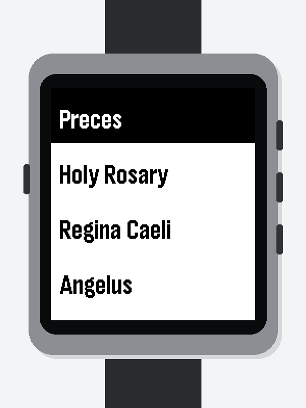
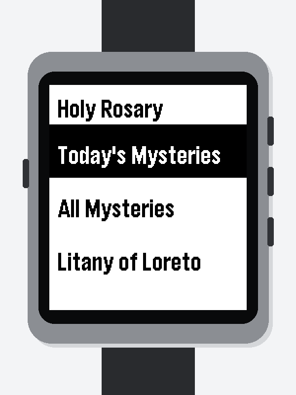
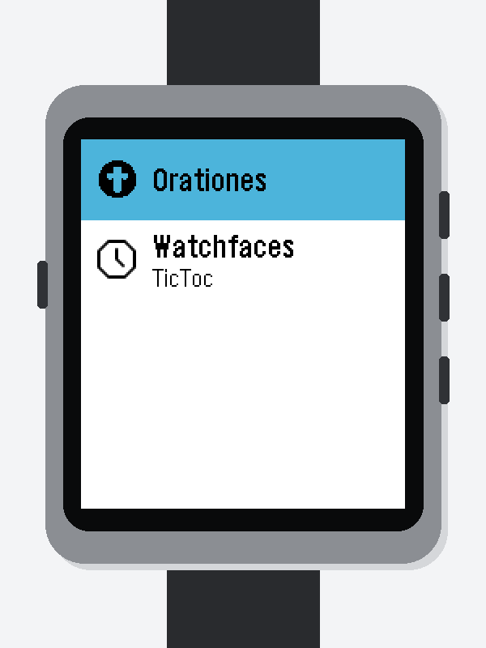
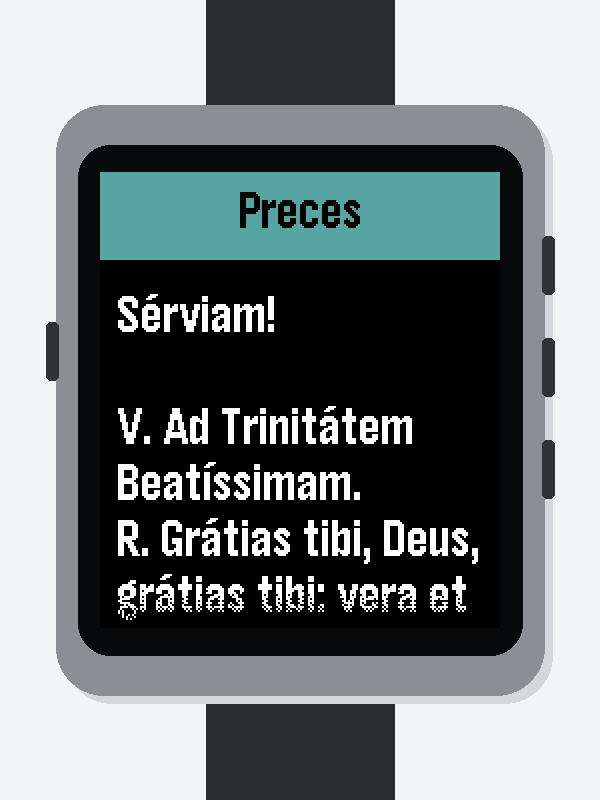
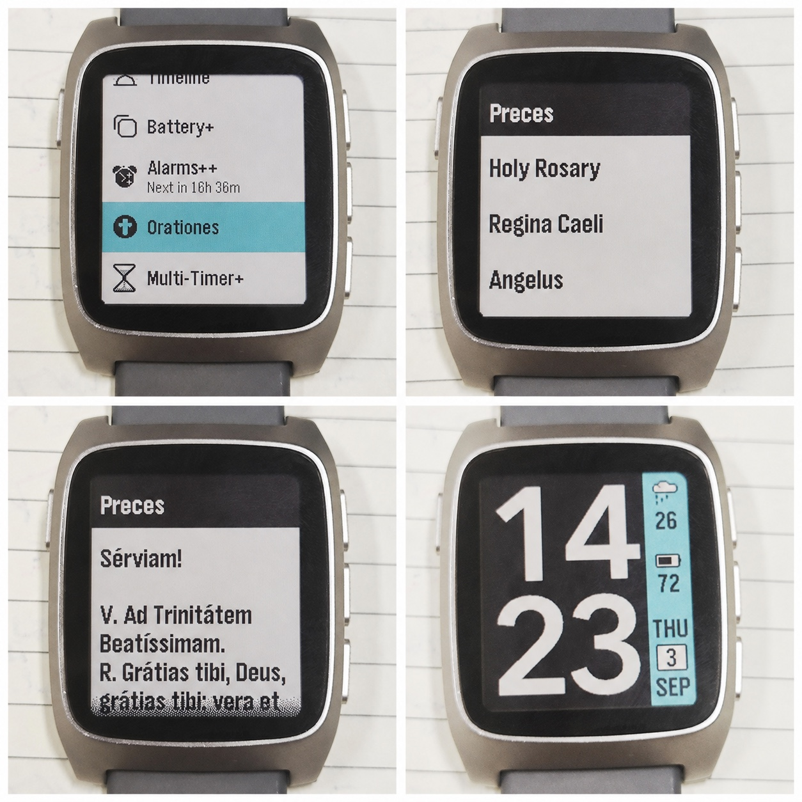

# Orationes

[](https://github.com/ewijaya/pebble-orationes/releases/latest)

A large-print, high-contrast Catholic prayer app for Pebble Time 2.

Orationes is a personal native Pebble C app built specifically for Pebble Time 2 (`emery`). It is designed around readability on a small watch display: large bold text, strong black-and-white contrast, and hardware-button navigation throughout. The app works fully offline.

<p align="center">
  
  
  
</p>

## Features

The main menu contains:

1. **Preces** — complete Latin text in a large-print, scrollable view.
2. **Holy Rosary** — Today's Mysteries, All Mysteries, and the Litany of Loreto.
3. **Regina Caeli** — English text in a scrollable view.
4. **Angelus** — English text in a scrollable view, with each Hail Mary abbreviated as `Hail Mary ...`.

Today's Mysteries is selected from the watch's local weekday. All four sets are also available directly:

- Joyful — Monday and Saturday
- Sorrowful — Tuesday and Friday
- Glorious — Wednesday and Sunday
- Luminous — Thursday

## Design

Orationes deliberately favors readability over text density. Prayer screens use Pebble's `FONT_KEY_GOTHIC_28_BOLD` font with 8 px horizontal margins. Menus use 54 px rows, with black text on white for unselected items and white text on black for the selected item. The interface stays simple, native, offline, and operable entirely with the watch's hardware buttons.

## Screenshots

| Launcher | Preces |
| :---: | :---: |
|  |  |

### On a physical Pebble Time 2

<p align="center">
  
</p>

## Install

Normal users do not need to build Orationes from source:

1. Open the [GitHub Releases page](https://github.com/ewijaya/pebble-orationes/releases).
2. Choose the latest release.
3. Download `pebble-orationes.pbw`.
4. Install the bundle using the Pebble/RePebble app workflow.

The current release targets Pebble Time 2 (`emery`) and is fully offline once installed.

## Build from source

Requirements:

- Pebble Tool 5.0.40 or newer
- Pebble SDK 4.33.1 or a compatible current SDK
- Python 3 and Pillow only when regenerating framed screenshots

Build the application bundle:

```sh
pebble clean
pebble build
```

The application bundle is written to `build/pebble-orationes.pbw`.

Install it in the Emery emulator:

```sh
pebble install --emulator emery
```

Install it on a physical PT2 through the developer connection:

```sh
pebble install --cloudpebble build/pebble-orationes.pbw
```

## Architecture

Orationes is an Emery-only native Pebble C SDK application. It has no PebbleKit JS, phone-side code, or network access. A reusable prayer screen renders scrollable texts, a reusable accessible menu renderer provides the high-contrast navigation, and Rosary data is kept separate from its menus. Prayer content is separated from UI code where practical. Builds produce a `.pbw` application bundle.

```text
src/c/
├── main.c
├── prayer_screen.*
├── accessible_menu.*
├── prayers.*
├── rosary_data.*
├── rosary_menu.*
└── litany.*
```

## Updating screenshots

Raw Emery captures are expected in `build/emulator-screenshots/`. Install Pillow and run the framing script from the repository root:

```sh
python3 -m pip install Pillow
python3 scripts/frame_screenshots.py
```

The script copies source captures to `docs/images/raw/` and writes consistent PT2-style composites to `docs/images/framed/`. The `build/` directory remains ignored.

## Releases

### v0.2.0

- Large-print, high-contrast interface
- Custom Orationes icon
- Latin Preces
- Rosary mysteries and Litany of Loreto
- Angelus and Regina Caeli
- Tested on a physical Pebble Time 2

### v0.1.0

- First functional Orationes release

## Status

Orationes is usable today and actively maintained as a personal project.

## Disclaimer

Orationes is an independent personal project. It is not an official application of, or endorsed by, Opus Dei, the Catholic Church, Core Devices, or Pebble.
