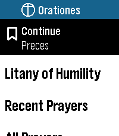

# Reading and navigation refresh — v0.10.0

This document describes the v0.10.0 reader. See [Install](../README.md#install)
for verified public availability and [release notes](releases/0.10.0.md) for the changes.
Prayer wording and the existing defaults, colors, body sizes, reminders, and
phone settings protocol are unchanged.

| Reading structure | Section navigation | Optional Continue First |
| --- | --- | --- |
|  |  |  |

These are unretouched, native 200×228 Emery captures of the development build.

## Controls

- **All Prayers:** Select a category, then Select a prayer to open it directly.
  Hold Select on a library prayer and release to open its Open/Pin options.
  A small library-header hint explains these two actions.
- **While reading:** Select opens Reading Options. Jump to section is offered
  when a prayer has multiple sections; Start again returns to the very top.
  Back dismisses options without moving your place. Double-Select still exits
  to the watchface. Existing taps, holds, and touch navigation remain available.
- **Continue:** opens the most recently saved prayer directly at its saved place.
  Start again is now in Reading Options rather than a mandatory intermediate menu.
- **Recent Prayers:** a short list remembers up to eight distinct prayers,
  most recent first. Selecting one resumes its own position. A ninth distinct
  prayer evicts the oldest entry. Ordinary library/shortcut openings still start
  at the top; they update that prayer's saved position when you leave it.
- **Settings → Continue First:** optionally puts Continue above the shortcuts.
  Default Off preserves the established order. This is watch-local and survives
  phone settings changes. Recent Prayers remains below the shortcuts; no shortcut
  is automatically moved or replaced.

## Reading structure

The shared reader segments newline-delimited text for display. Responses marked
`R.` use a 12 px inset and a monochrome side rule; the body retains the existing
28/34 px sizes and 8 px outside margins. Existing blank breaks become measured
14 px paragraph gaps. Come, Holy Spirit gains a gap after each three-line stanza.
The three existing inline Humility responses occupy their own response blocks;
they are not repeated. Its approved attribution stays at 14 px.

Preces and both litanies have section jumps derived from existing text. Other
prayers use existing stanza/paragraph boundaries. Aspirations has ten jump
groups (1–10 through 91–92), keeping each Latin/English/reference group together.
Jump labels may be shortened in the menu; prayer text is never shortened.
Single-paragraph prayers show only Start again.

Saved plain-text positions use source-byte anchors plus the fraction through the
block, independent of font size. Existing styled positions remain supported;
the prior one-body Humility bookmark is migrated approximately by its fraction.
Switching text sizes and back can round the displayed position by one pixel.
The eight-entry history is one recoverable alternating record at keys 48/49;
the old single bookmark at 42/43 is read as an upgrade fallback. Disabling
Remember Place clears both histories. Continue First uses new keys 46/47, leaving
settings schemas 1/2 and their phone serialization untouched.

## Space and integrity

Aspirations is packaged as a generated raw resource: original paragraph text,
style, and spacing are preserved byte-for-byte and checked against compiled C in
host tests. Loading it on demand frees executable-image capacity for navigation;
the data and font caches remain resident until app exit. No prayers are removed.

`tests/test_reading.c` checks source-byte order, section counts, all packaged
Aspirations paragraphs, old-bookmark recovery, interrupted writes, history
ordering/eviction, and Continue First persistence. `scripts/qa_reading.py`
exercises the shared reader and navigation in Emery; `--full` covers both sizes
in both appearances. Original v0.9 screenshots remain in `tests/screenshots/`;
the intentional response-layout baselines are in `tests/screenshots/reader-structure/`.

See [releasing.md](releasing.md) for the prepare/publish/verify tool. Preparation
and successful tests do not themselves establish public availability.

## Development verification — 7 September 2026

The following evidence is from the development build before the v0.10.0 version
bump; it is not the versioned candidate's publication receipt.

The clean Emery build and host regression suite pass, including content checks,
storage interruption tests, phone-settings integration, and seven offline release
safety tests. The build has 40,318 bytes of resources, a 59,347-byte RAM footprint,
71,725 bytes of free heap reported at link time, and a 782,585-byte PBW. The virtual
image is 59,348 bytes, below the platform's 65,535-byte limit. The established
SDK RWX linker warning remains non-fatal.

Preces and Litany of Humility passed section jumps, both scroll clamps, restart,
font-size round trips, reopening, and double-Select exit in all four size/theme
combinations. Aspirations passed the same checks in Extra Large/Dark; its native
scroll coordinates are scaled for its long document. The earlier Large/Light
smoke pass also covered Angelus, Loreto, Aspirations, and Come, Holy Spirit.
Direct library opening, held options, pinning, two independent saved places,
Recent Prayers, direct Continue, and Continue First persistence passed end to end.
Screenshots were inspected for readable labels, the small attribution, response
insets, and complete final lines. Reminder logic and physical touch input were
not re-exercised as part of this reader-focused pass.

All five reader screenshot comparisons pass: Preces and Angelus use the reviewed
response-layout baselines; Aspirations in both tested sizes and the prayer card
still match their original v0.9 prayer/title pixels. Raw documentation captures
and the three generated watch frames were visually inspected. The final PBW hash
is unchanged after emulator and physical installation.

This development PBW was installed on the connected physical Pebble Time 2 and
its launch screen was captured. Wrist-distance readability and hands-on touch
behavior still require physical review; emulator results do not establish those.
No version bump, commit, tag, upload, or store-listing update was performed during
that development pass.

Against v0.9.0, the prayer literals are unchanged. Aspirations gains a generated
resource loader, not new wording. Litany of Loreto, Rosary data, liturgical calendar,
prayer cards, and prayer collections are unchanged files. The two local canonical
text files retain their original hashes and remain ignored and untracked.

PBW SHA-256: `1d22c5fae8cd78a88d437f379eb5462ff1970e2de8e63c53f231fd0c275c8be9`.
