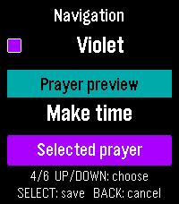
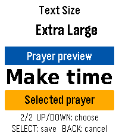
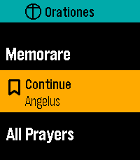
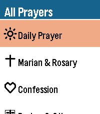
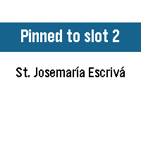

# Native UI refresh — v0.8.0

These improvements ship in v0.8.0. See [release verification](verification.md)
for the final candidate and its checks. The development-build metrics and physical
installation notes below preserve the earlier 2026-09-05 implementation history;
their hashes identify those intermediate builds, not the final release PBW.

## Implemented

1. Independent Navigation Highlight: Classic, Amber, Tangerine, Violet, Magenta,
   and Lime. Selected text uses black or white for contrast.
2. Compact Orationes cross-and-wordmark header on the main menu.
3. Continue includes the saved prayer's full name and a bookmark icon.
4. Distinct native icons for the five All Prayers categories.
5. Settings labels and values use a clear hierarchy and measured spacing.
6. Main, collection, library, shortcut, and Rosary labels wrap to measured rows;
   long menu headers also grow to fit.
7. A fixed four-pixel edge progress indicator replaces the reader's dotted shadow.
8. Pinning or clearing a shortcut briefly confirms the slot and prayer, then
   returns to the selected shortcut. Select or Back can dismiss the notice.
9. Native previews for text size, appearance, Title Accent, and Navigation Highlight;
   the phone preview also shows body size, title, and selection colors together.
10. A crisp native 25×25 launcher icon, with editable SVG source.

Existing Title Accent palettes keep their colors and identifiers. Classic preserves
previous selection colors on upgrade. Prayer body colors remain black/white.
No prayer wording, mystery content, weekday mapping, or guided Rosary was added or
changed. The Chapel promotional palette remains separate from these controls.

## Storage and size

Settings schema 2 uses a new alternating record pair (44/45); the original schema 1
pair (40/41) stays intact during migration. Existing font, appearance, accent,
reminder, reading preference, and all seven shortcuts are preserved. The new setting
is appended to the phone message keys so existing numeric identifiers stay stable.

Preces remains authored in its original C literal. A generated binary resource
contains the exact same 3,712 bytes, including the NUL terminator, and is cached on
first use. This and link-time optimization make the UI fit Pebble's 65,535-byte
loaded/virtual-image fields. The process header is explicitly retained under LTO.
The source-file integrity hash changed only for this loading code; the literal itself
did not change, and a compiled-C/resource comparison guards the complete text.

| Final clean build | Bytes |
| --- | ---: |
| Resources | 28,695 |
| Static RAM footprint | 64,764 |
| Initial heap reported by SDK | 66,308 |
| Loaded image | 63,596 |
| Virtual image | 64,764 |
| PBW | 775,556 |

Preces' first load consumes another 3,712 heap bytes, plus allocator overhead.
Custom fonts are lazily shared by the reader and previews and retained until app
exit. A font-size round trip exposed incorrect italic line spacing when font
handles were freed and reused; stable handles prevent that reuse.
The SDK's established RWX linker warning remains non-fatal.

PBW SHA-256: `69a66286d27ce557767fa01d247e934634f05dfca640e422ef72fa90787c88a7`.

## Verification

- Host tests pass with AddressSanitizer and UndefinedBehaviorSanitizer, including
  migration, interrupted writes, all navigation choices, invalid messages,
  acknowledgments, and complete packaged-text equality.
- Phone preview tests cover all 48 appearance/title/navigation combinations.
- The clean Emery build passes metadata, header, resource, RAM, and bundle gates.
- Five original prayer screenshots match exactly outside the intentional right-edge
  indicator and former bottom-shadow region; original baselines are retained.
- Native navigation previews, cancel/save, and relaunch persistence pass in Emery;
  every Title Accent can change independently in both appearances.

- Native shortcut clearing shows the confirmation and returns to a usable
  empty main menu; All Prayers remains accessible.
- Preces and Aspirations pass scroll, double-Select exit, relaunch, Resume,
  size round trip, and Start again. The italic-spacing regression is covered here.
- Library categories, long card names, pin confirmation, return selection, and
  opening the pinned prayer were visually checked. Pinning works with no favorites.
- Preces in Large/Light and Litany in Extra Large/Dark reach their exact final lines,
  clamp at both ends, and return to the same top pixels after long Up/Down presses.

## Emulator examples

| Navigation preview | Font preview | Continue |
| --- | --- | --- |
|  |  |  |

| Category icons | Pin confirmation |
| --- | --- |
|  |  |

The preview tests capture raw palette values with `--no-correction`; flow images
use the CLI's normal display-color correction. These are emulator screenshots,
not a claim of wrist-distance readability on physical hardware.

## Physical PT2 installation

The exact PBW identified above installed successfully through CloudPebble on
2026-09-05. A subsequent screenshot from the physical PT2 confirms that Orationes
opens with the new wordmark header and configured shortcuts. Evidence is retained
locally in `build/pt2-ui-installed.png` and is not used as public store artwork.

This verifies installation and startup. Physical touch interaction, wrist-distance
readability, and the settings page in the actual phone app still require hands-on
QA. The complete native UI, settings persistence, and phone preview logic were
exercised in Emery and host tests as listed above. No version bump, GitHub release,
or RePebble app release was performed for this development build.

## Approved icon revision — 2026-09-05

The user approved a regular cross meeting its surrounding circle at all four ends.
The exact approved 25×25 asset now appears in the launcher; the header uses a pixel
mask generated from the same PNG, tinted to the current foreground color.
An Emery screenshot comparison confirms every header-icon pixel matches the asset.
The launcher was visually checked, and the matching main-menu, Continue, and
launcher screenshots were refreshed in the raw and framed documentation folders.

The clean build passes with 28,686 resource bytes, 64,977 static RAM bytes,
66,095 reported heap bytes, a 63,812-byte loaded image, and a 64,980-byte virtual
image. The established SDK RWX linker warning remains the only build warning.
The 775,762-byte PBW installed successfully on the physical PT2; a watch screenshot
confirms the approved mark in the running app (`build/pt2-approved-icon.png`).

Icon-build SHA-256: `4fb59645063fa1c0a74d55d3c3d8ac2f1e74a0ca1657fdf06185c28f02e85679`.
This icon revision retains package version 0.7.0; no public release was published.
